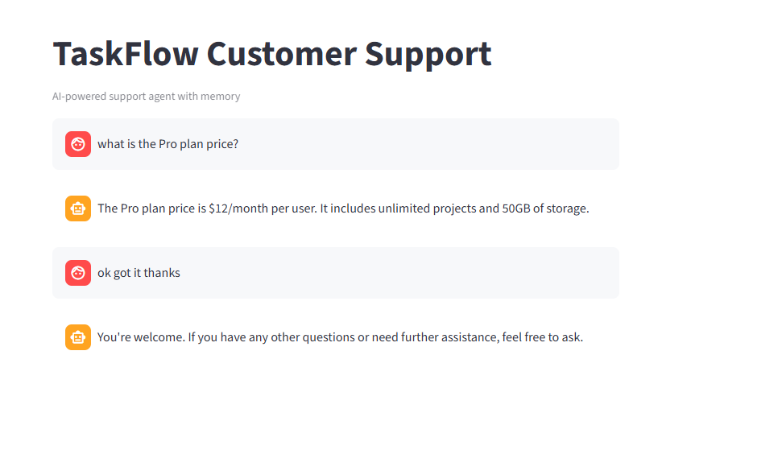
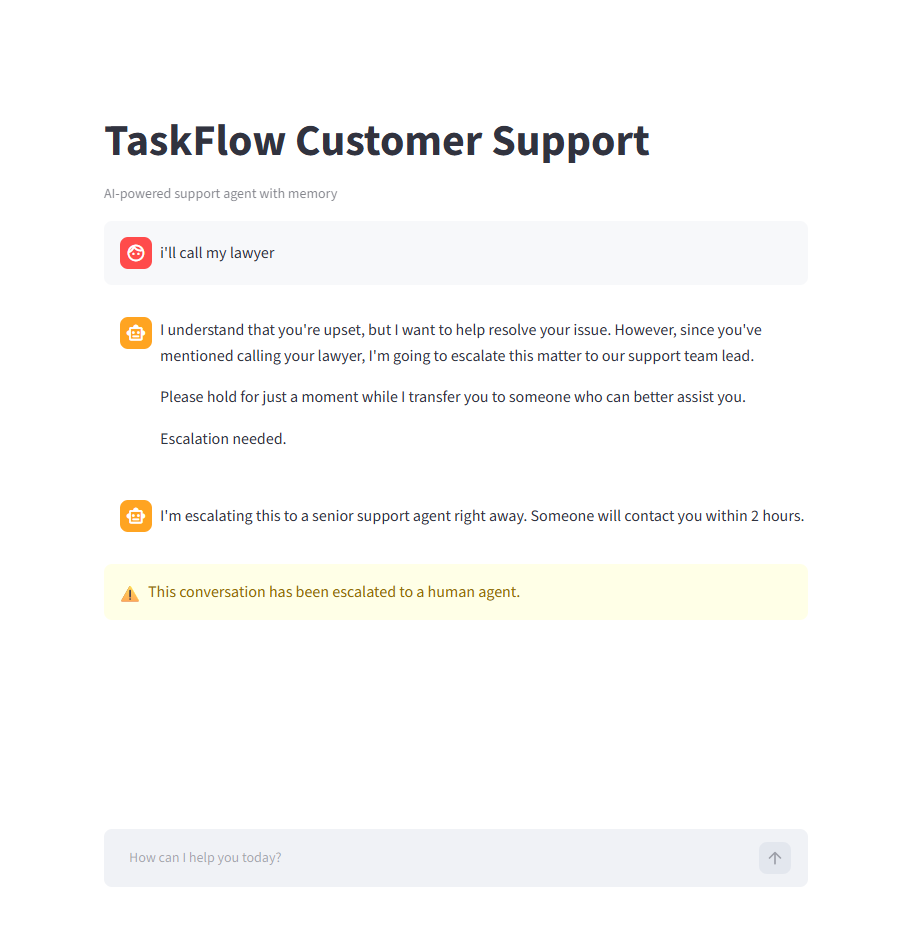

# AI Customer Support Agent with Memory

A stateful AI customer support agent built with LangGraph that remembers conversation history and automatically escalates complex issues to human agents.

## What it does
- Answers customer questions using a knowledge base (FAQ retrieval)
- Remembers the full conversation — users never repeat themselves
- Detects escalation triggers (legal threats, data loss, angry users) and routes to human support
- Built for TaskFlow, a fictional SaaS product management tool

## Tech stack
- **LangGraph** — stateful agent graph with conditional routing
- **Groq API** (LLaMA 3.3 70B) — fast LLM inference
- **LangChain** — LLM integration and message handling
- **Pydantic** — typed state management
- **Streamlit** — chat UI

## How it works
1. User sends a message
2. Agent reads full conversation history from state
3. Answers from knowledge base via LLM
4. Checks for escalation triggers after every response
5. If triggered → routes to escalation node → notifies user

## Screenshots
### Normal conversation


### Escalation triggered


## Run locally
```bash
git clone https://github.com/chitranshi0613/customer-support-agent
cd customer-support-agent
pip install -r requirements.txt
# Add your GROQ_API_KEY to .env
streamlit run app.py
```

## Key concepts learned
- LangGraph StateGraph and conditional edges
- Conversation memory with typed state (Pydantic + Annotated)
- Escalation logic with keyword detection
- Secure API key management with .env
